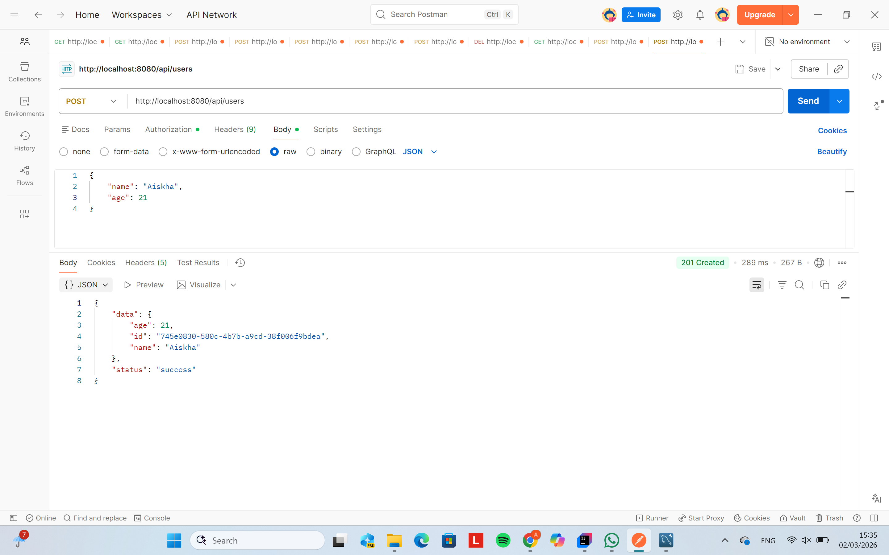
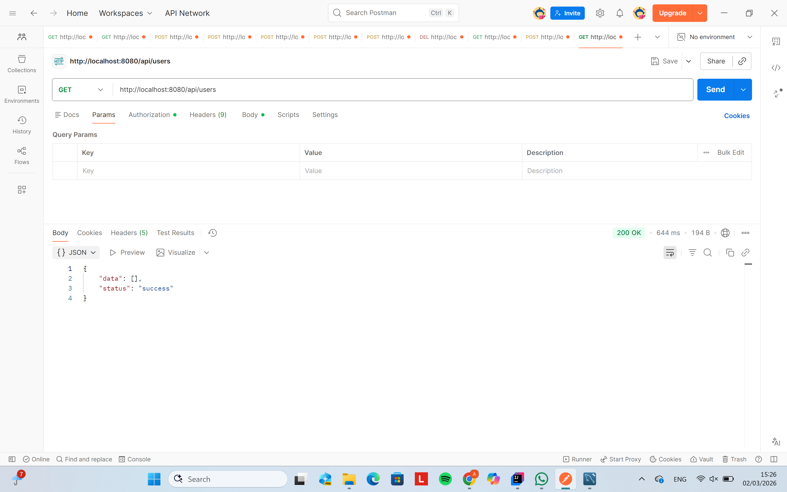
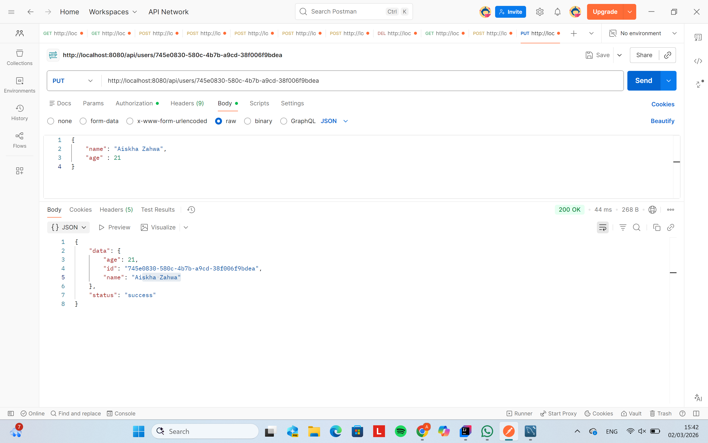
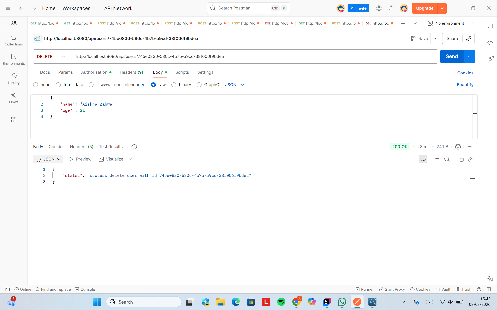
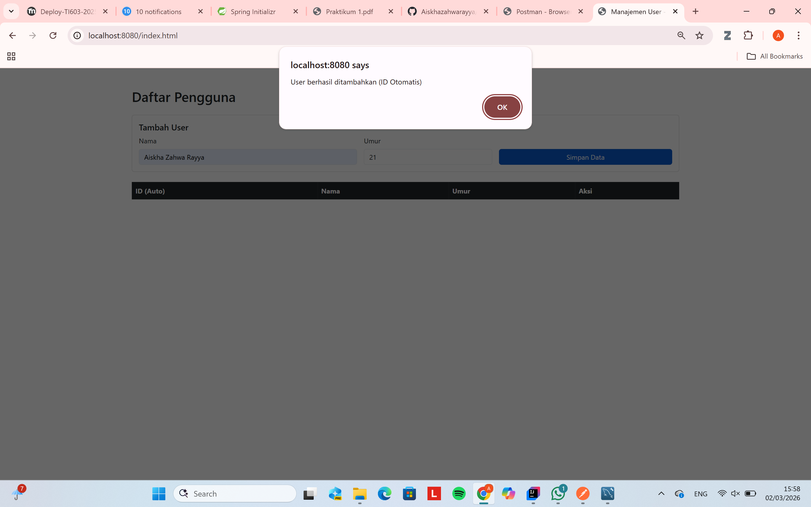
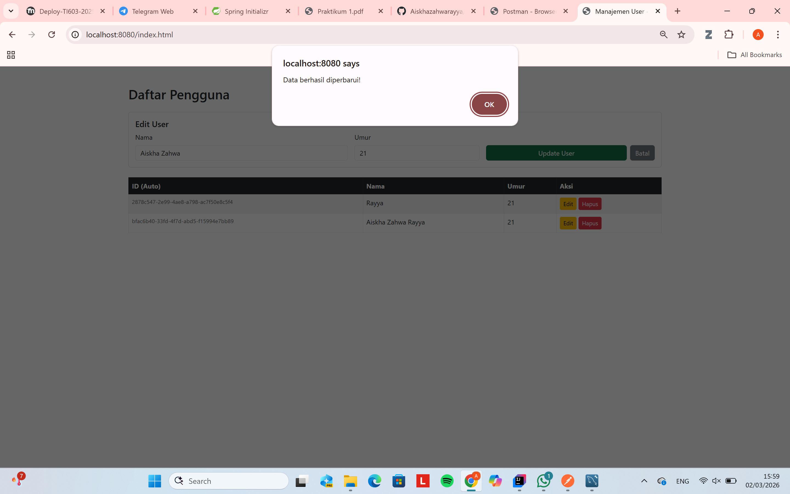
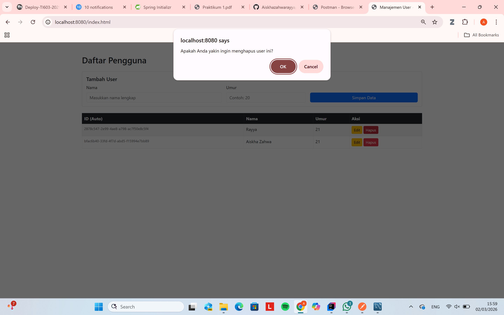
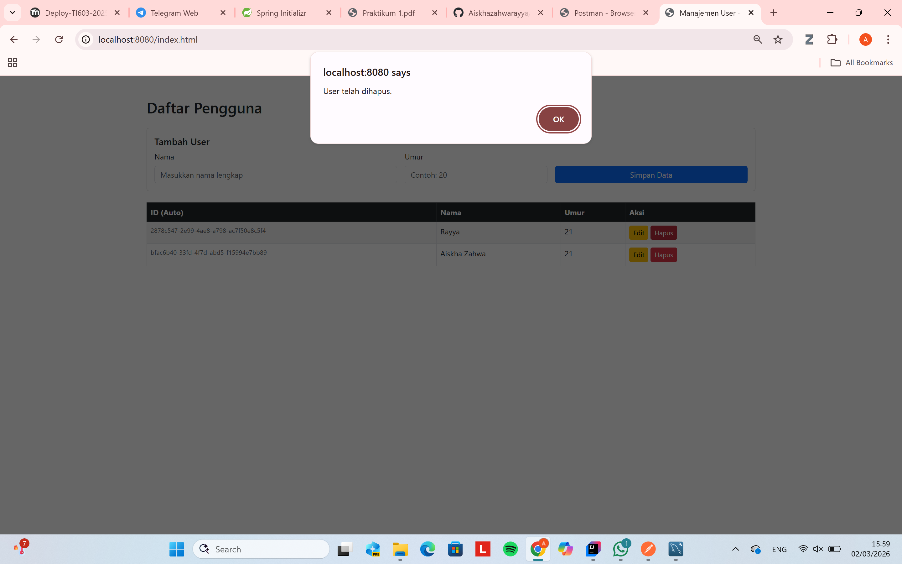
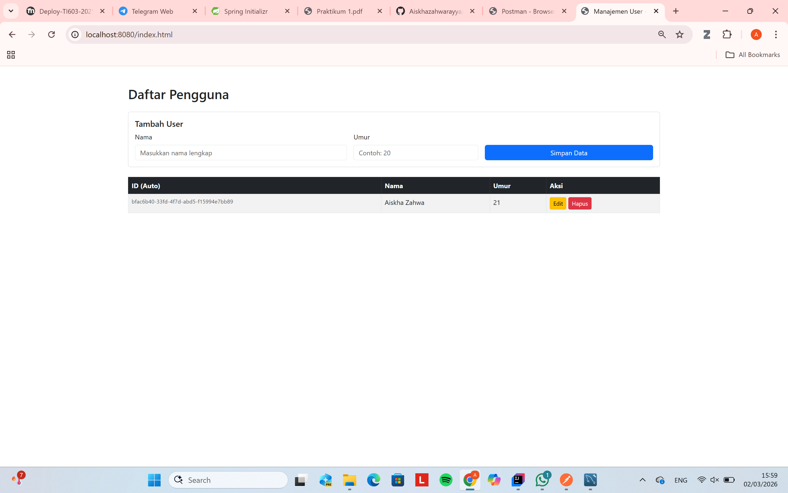

# User API Specification

## API Endpoint

### 🔹 Create User
Endpoint : POST /api/users 

Request Body :

```json
{
  "nama" : "Aiskha",
  "usia" : 21
}
```

Response Body (success) :

```json
{
  "status": "success",
  "data": {
    "age": 21,
    "id": "random string",
    "name": "Aiskha"
  }
}
```




### 🔹 Get All Users
Endpoint : GET /api/users

Response Body (success) :

```json
{
  "status": "success",
  "data": [
    {
      "age": 21,
      "id": "random string",
      "name": "Aiskha Zahwa"
    }
  ]
}
```



### 🔹 Update User
Endpoint : PUT /api/users/{id}

Request Body :

``` json
{
  "nama" : "Aiskha Zahwa",
  "usia" : 21
}

```

Response Body (success) :

```json
{
    "status": "success",
    "data": {
    "age": 21,
    "id": "random string",
    "name": "Aiskha Zahwa"
  }
}
```



### 🔹 Delete User
Endpoint : DELETE /api/users/{id}

Response Body (success) :

```json
{
"message": "Successfully delete user with id (random string)"
}
```



## Dokumentasi API






